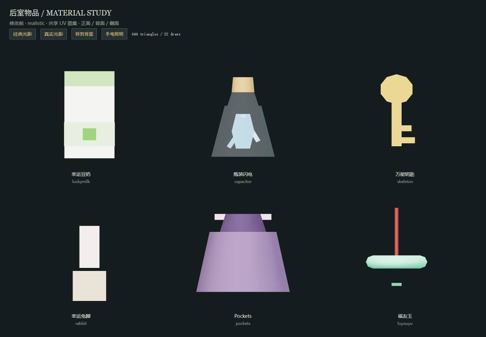
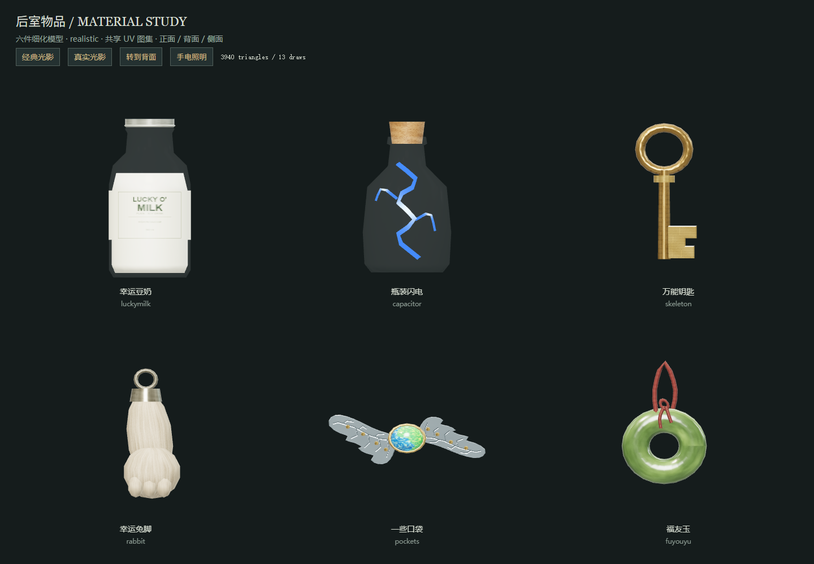

# 六件物品模型与 UV（2026-10-04）

本轮更新 `luckymilk / capacitor / skeleton / rabbit / pockets / fuyouyu`。保留 ID、数值、装备位、掉落规则、投掷结算和存档结构。模型入口仍为 `buildItemMesh(type, { halo })`，地面、投掷、本地手持与远端手持共用 `src/game/renderer/sixItemMesh.ts`；三个冲突的描述、像素图标及 SVG 缺图回退同步更新。

| 物品 | 外形 | 原面数 → 新面数 | 原绘制 → 新绘制 |
| --- | --- | ---: | ---: |
| 幸运豆奶 | 白色豆奶、老玻璃奶瓶、收肩、厚底、液面、卷边压盖、一体标签 | 48 → 608 | 4 → 3 |
| 瓶装闪电 | 单层玻璃瓶、瓶唇、嵌入软木塞、三支蓝白电弧 | 140 → 464 | 6 → 3 |
| 万能钥匙 | 原创黄铜酒店钥匙、镂空匙环、轴肩、倒角匙齿 | 76 → 388 | 4 → 1 |
| 幸运兔脚 | 原创护符、脚踝/脚掌/趾部、金属帽与挂环、顺向毛流 | 24 → 656 | 2 → 2 |
| 一些口袋（pockets） | 按用户附图制作银色双叶胸针、蓝绿蛋白石、金色包镶/铆珠、背面别针 | 68 → 1,184 | 3 → 2 |
| 福友玉 | 苔藓绿软玉环、内孔、圆边、红绳与结 | 288 → 640 | 3 → 2 |

计数不含既有地面拾取光环。每件 ≤1,200 面、≤3 批；静态部件按材质在工厂内合并。玻璃只绘制朝外一层，关闭 depthWrite；没有实时折射、物品附加灯光或后处理。玉和蛋白石保持不透明，电弧使用不受光照影响的 Basic 材质。手持姿态将可辨认部分抬到手掌上方。远端切换/离开会释放旧物品独立几何和材质，保留共享纹理。

## 贴图与 UV

六件共用 `public/textures/items-six/` 中 1024² sRGB 颜色图集、512² OpenGL (+Y) 法线图集和 512² 线性粗糙度图集。十六块图集分区及边界见 `layout.json`。颜色边缘扩展 8 px，法线和粗糙度保留对应 4 px 边界，Linear mipmaps 沿用项目贴图加载与各向异性质量设置。

瓶身采用背面接缝的圆柱/旋转面 UV，底面与盖分开；钥匙正反面平面展开，侧壁独立条带；兔脚沿纵向布置毛流。细纹、软木孔隙、氧化、矿物云絮和编绳纹理由离线脚本生成，不增加毛发几何或透明毛片。经典模式加载颜色/法线，真实模式按需加载粗糙度；实例的 geometry/material 独立，文件纹理由 `levelTexture` 缓存共享。

生成：在 `app` 运行 `npm run generate:six-items`。三个图标保持 32² 像素设计放大为 128² 透明 PNG；旧批量图标脚本会跳过这些已存在的图标，以本轮专用生成器为准。具体 Wikidot 作者、译者、许可与改编声明见 [SOURCES.md](public/textures/items-six/SOURCES.md)。万能钥匙、幸运兔脚是项目原创，没有套用 Wikidot 编号。

## 验收结果

- `npm run check:six-items`：有限顶点/法线/UV、无退化面、图集内缩边距、不跨区、尺寸、面数、批次、双光影贴图配置、玉环孔射线、halo 开关、实例与共享纹理释放检查通过。
- `npm run check:item-batches`、`check:texture-images`、`check:model-warmup` 通过；生产构建通过。
- `verifier/six-icons.tsx`：实际 HUD 三个 128² 像素图加载通过，主动触发图片错误后三个 SVG 回退通过，包括奶瓶的 `milk` glyph 分支。
- `verifier/six-items-runtime.ts`：102 项通过，运行真实 Engine 的拾取/E 交互/丢弃、计时饮用及 +40/+20/+30、瓶装闪电数量与投掷速度、四种口袋装备、一些口袋 +4/卸下、快捷栏 ID 传递和远端模型释放。远端会话为本地构造的状态输入，没有连接真实网络对端。
- 双光影正面、背面、侧面、暗处手电、带原手掌/袖子的手持展示均有前后截图。标签未镜像、瓶内电弧可见，一些口袋背针与福友玉通孔可辨。小字在远距离由 mipmap 自然淡出；不追求地面距离读取成分表。
- 连续八轮模型回收重建：手持展台几何固定 25，纹理经典 4 / 真实 5（含展台环境纹理）；60 件压力场景几何固定 130。远端连续 36 次切换与离开未释放共享图集。

### 性能对照

设备：Windows，NVIDIA GeForce RTX 4060 Laptop GPU，驱动 32.0.15.9174，Chrome Headless，ANGLE D3D11 硬件 WebGL。固定视口 960×640、DPR=1（画布 960×500，其余为标头），抗锯齿开启；同一正交相机、灯光与 RoomEnvironment。每项预热 60 帧，采样 180 帧，五轮；六个单件近景和每种十件共六十件分别采样。每轮统计均保存在原始 JSON，表格是五轮统计的中位数。

| 60 件场景 | 绘制调用 前 → 后 | 面数 前 → 后 | 帧中位数 前 → 后 | 帧 P95 前 → 后 | render+finish 中位数 前 → 后 |
| --- | ---: | ---: | ---: | ---: | ---: |
| 经典 | 220 → 130 | 6,440 → 39,400 | 4.20 → 4.20 ms | 4.30 → 4.30 ms | 0.60 → 0.40 ms |
| 真实 | 220 → 130 | 6,440 → 39,400 | 4.20 → 4.20 ms | 4.30 → 4.30 ms | 0.60 → 0.40 ms |

14 个比较项（两种光影 × 六单件与一混合场景）全部通过绘制调用和 `max(5%, 0.5ms)` 的帧时间阈值。帧间隔受刷新节奏限制，不能将该数据等同于完整游戏的帧率上限；补充的 render+finish 是 CPU 提交与同步耗时，不是 GPU timer query。

首版吊坠的 SwiftShader 软件 WebGL 测试未通过（混合场景帧中位数约 8.3 → 25 ms）。这组原始数据保留于 `reports/six-items/software-webgl/`，不与硬件数据混合。未测 Android 真机，也未把桌面触控模拟作为 Android 性能结论。

## 复现

1. `npm run dev -- --host 127.0.0.1 --port 3004 --strictPort`。
2. 打开 `/verifier/six-items.html?mode=classic`；可选 `mode=realistic`、`baseline`、`held`、`angle=3.141592653589793`。基线来自修改前工厂的精确六件提取，保存在 `verifier/six-items-baseline.ts`，不依赖 Git 工作树是否干净。
3. 自动截图/性能脚本需启动**独立临时配置目录**的 Chrome CDP（不要使用自己的普通浏览器 profile）。本次用 `--headless=new --use-angle=d3d11 --ignore-gpu-blocklist --remote-debugging-port=9235 --user-data-dir=<独立临时目录>`；先打开上述本地页面。
4. PowerShell 设置 `$env:SIX_ITEM_CDP='9235'`；按顺序运行 `node scripts/verify-six-items.mjs visuals classic before`、`bench classic before`，将参数分别换成 `after` 与 `realistic`，不要并行跑基准。默认 URL 为 3004，可用 `SIX_ITEM_URL` 调整。
5. `node scripts/verify-six-items.mjs runtime`；`node scripts/summarize-six-items.mjs`。输出写入 `reports/six-items/`。最后运行上述回归命令和 `npm run build`。

## 截图和原始数据

更多视图：[一些口袋胸针近景](reports/six-items/pockets-brooch-review.png)、[经典手持](reports/six-items/after-classic-held.png)、[真实背面](reports/six-items/after-realistic-back.png)、[真实侧面](reports/six-items/after-realistic-side.png)、[暗处手电](reports/six-items/after-realistic-dark.png)。

后续外观修订：按用户提供的胸针照片把 Pockets 显示名统一为“一些口袋”，替换此前的椭圆吊坠。两片有倒角的雕叶、金色包镶与八枚铆珠合并为一批，蛋白石一批，共 1,184 面、2 批；叶脉写入银色分区的颜色/法线/粗糙度，保留同一套共享图集尺寸。背面有别针、铰座和卡扣。像素图标、SVG 缺图回退、物品描述与 Level 9 的用户提示同步更新，内部 ID、容量及警告机制保持原状。

原始结果：[汇总](reports/six-items/summary.json)、[经典修改前](reports/six-items/before-classic-performance.json)、[经典修改后](reports/six-items/after-classic-performance.json)、[真实修改前](reports/six-items/before-realistic-performance.json)、[真实修改后](reports/six-items/after-realistic-performance.json)、[功能检查](reports/six-items/runtime.json)。
